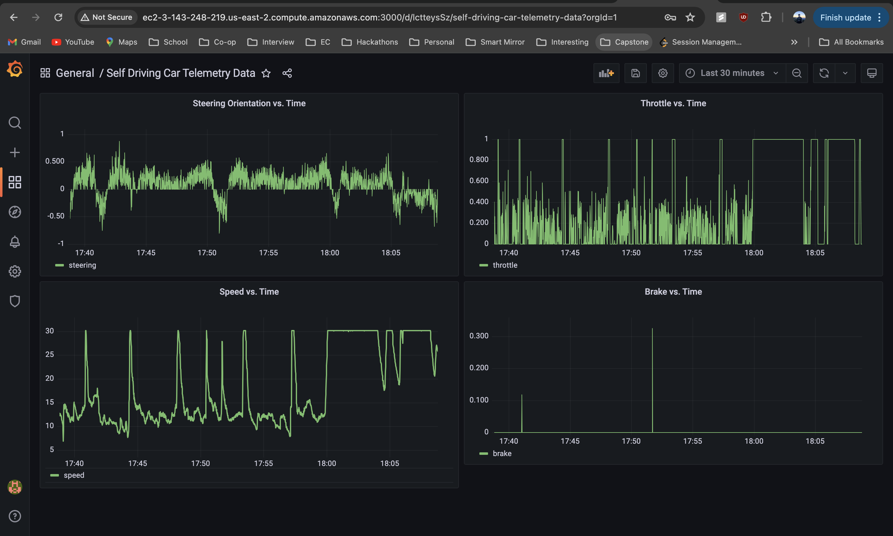

# Telemetry Data Processing POC

This project is a proof-of-concept (POC) that demonstrates the ingestion, processing and visualization of open-source telemetry data using Python, AWS services, PostgreSQL and Grafana.

## Tools and Technologies:

- **Amazon Web Services (AWS)**: Used to host the PostgreSQL database and EC2 instance
    - **Amazon RDS**: Relational Database Service to host PostgreSQL
    - **Amazon EC2**: Elastic Compute Cloud for running the data processing script and Grafana server

- **PostgreSQL**: Database used to store telemetry data

- **Python**: Used to write data processing script
    - **Libraries**:
        - `pandas`: Data manipulation and analysis
        - `psycopg2`: PostgreSQL database adapter for Python

- **Grafana**: Open-source platform for monitoring and observability, used to visualize the telemetry data

## Results

Using the above tools and technologes, an AWS EC2 instance was created to complete the project and created the dashboard below to visualize a static data collection of telemetry data for a self-driving car from Udacity's Self Driving Car dataset.

## Improvements for Real-Time Data Streaming

### Real-Time Data Ingestion

- **Apache Kafka**: Use a real-time data ingestion service
- **RabbitMQ**: Use a message queue service

### Real-Time Data Processing

- **Apache Flink**: Process the stream data from the services above
- **Python Scripts**: Modify the current script to consume data from a streaming source and schedule writes to PostgreSQL

### Data Storage

- **PostgreSQL**: Good for structured storage model
- **InfluxDB**: Alternative for high-speed writes and querying